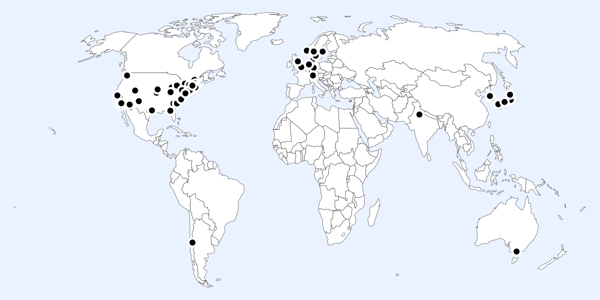

# Collaboration

The most impactful work occurs when [diverse groups](https://sites.lsa.umich.edu/scottepage/wp-content/uploads/sites/344/2015/11/pnas.pdf) tackle [complex problems](https://pubsonline.informs.org/doi/pdf/10.1287/mnsc.14.4.B141). I help create these groups in my work and in various community-building endeavors.

## Community building

I enjoy engaging with scholarly communities and have participated in more than 140 conferences and workshops since beginning graduate school. I also enjoy building and strengthening scholarly communities related to my research interests. I have organized (or co-organized) 4 conferences, 7 mini-conferences, and nearly 200 seminars and workshops. 

Conference and talk locations.

### Virtual workshops

I’ve taken a particular interest in virtual workshops, since they democratize the spread of research and the dissemination of high-quality feedback. 

### APOSS

I’ve founded or co-founded three long-standing virtual workshops. Most recently, I was the founder and co-organizer of the [Asian Politics Online Political Seminar Series (APOSS)](http://aposs.cc/). Motivated by the wave of conference and seminar cancellations in the spring of 2020, the series aimed to provide political scientists working in, on, or adjacent to Asia with a forum where they could receive feedback about their work in progress. The series ran for 104 workshops and had an active community of nearly 500 scholars subscribed to its mailing list.

One of so many great APOSS presentations.

A survey I conducted of APOSS attendees shows that folks found the workshop more useful for their research than attending annual professional conferences *and* better than other online seminar series. Attendees praised the workshop extensively for its approach to diversity and building community. 

### Select APOSS evaluation written comments

> This workshop has been a gem for many scholars who do not have many opportunities to network with other scholars and to present their work.
> 

> This workshop did a better job in maintaining equity. I find other workshops elitist, clearly favoring participants from elitist universities.
> 

> [It’s] accessible to all scholars including early career scholars, graduate students and international scholars.
> 

> Thank you immensely for coordinating this - it was an absolute lifesaver for me, especially during the challenging times of COVID.
> 

> By giving PhD students/candidates the chance to present their research virtually, APOSS is really a valuable platform to increase early career researchers the chance to introduce their works. Furthermore, since it is online, scholars from third-world countries like myself can present my research without worrying about visa issues.
> 

### JPOSS

One of many great JPOSS presentations.

I was also co-founder and co-organizer of the [Japanese Politics Online Seminar Series (JPOSS)](http://jposs.org/), a virtual forum for presenting and discussing research-in-progress on questions related to Japanese politics, broadly defined. The series, which is still ongoing, ran for 40 sessions before I left my role.

### VWAR

In addition, I co-founded and co-organized the [Virtual Workshop on Authoritarian Regimes (VWAR)](http://authoritarianregimes.org/) for several years. This virtual workshop, one of the first in political science, provided scholars of authoritarian regimes with an opportunity to receive feedback from multiple discussants on their research in progress. Over my four years of involvement, we held 43 sessions.

And one of many great VWAR presentations.

### Workshop presenter feedback

A survey I continuously conducted of VWAR and APOSS presenters shows that most participants [(1) thought that their participation was more useful for their research than presenting at a large conference and (2) rated VWAR/APOSS better than other virtual workshops at which they had presented](https://www.notion.so/7a58ff50f7dd425c91148fa424494e46?pvs=21). 👇 

[Virtual workshop evaluations](Collaboration/Virtual%20workshop%20evaluations%20206d6228a5324255a5d122d2fffa0225.md)

### Research on collaboration and scientific community

Based on my experience running several virtual workshops, I prepared a [spotlight for *PS: Political Science & Politics* that examines how these spaces can enhance diversity, equity, and inclusion in the discipline](https://www.notion.so/Building-Community-and-Improving-Diversity-Equity-and-Inclusion-in-Political-Science-through-Virtu-957e1fb38cdb43de8ade2f5ad4d4d165?pvs=21). 

## Coauthors

I enjoy working with others, and I've been fortunate to collaborate with many talented, kind scholars worldwide.

My esteemed collaborators.

Please check out their websites, read their research, and consider collaborating with them. Affiliations are listed as they were at the start of each collaboration.

- [Kenya Amano](https://jaeyk.github.io/) (Washington)
- [Margaret H. Ariotti](http://mollyshewrote.org/) (Georgia)
- [Tiffany D. Barnes](https://tiffanydbarnes.weebly.com/) (Texas)
- [Quintin H. Beazer](http://myweb.fsu.edu/qbeazer/) (Florida State)
- [Megan Biek](https://www.researchgate.net/profile/Megan_Biek) (Penn State)
- [André Blais](https://www.chairelectoral.com/director.html) (Montreal)
- [Ray Block](https://polisci.la.psu.edu/people/ray-block) (Penn State)
- [Mitchell Bosley](Collaboration%2081584a40b9c843fea9496935e1aaaba1.md) (National Center for AI Research)
- [Bart Bonikowski](https://wp.nyu.edu/bonikowski/) (NYU)
- [Jennifer Brick Murtazashvili](https://www.murtazashvili.org/) (Purdue)
- [Daniel M. Butler](https://www.danielmarkbutler.com/) (UC, San Diego)
- [Amy Catalinac](https://scholar.harvard.edu/amycatalinac/home) (NYU)
- [Luca Caviezel](https://www.linkedin.com/in/luca-caviezel/) (Dartmouth)
- [Rohan Chakravarty](https://www.linkedin.com/in/rohan-chakravarty/) (Dartmouth)
- [Ke Cheng](https://www.linkedin.com/in/ke-cheng-855963126/) (Waseda)
- Yipeng Cheng (Waseda)
- [Adam Chilton](http://www.adamchilton.org/) (Chicago)
- Alice Chong (Waseda University)
- [Paul Christensen](https://www.rose-hulman.edu/academics/faculty/christensen-paul-christen.html) (Rose-Hulman Institute of Technology)
- [Volha Chykina](http://volhachykina.org/) (Richmond)
- [Katherine Clayton](https://sites.google.com/view/kclayton) (Stanford)
- [Courtenay Conrad](http://www.courtenayconrad.com/) (UC, Merced)
- [Kevin Cope](http://kevinlcope.com/) (Virginia)
- [Mia Costa](https://www.miacosta.com/) (Dartmouth)
- [Yaoyao Dai](https://yaoyaodai.github.io/) (UNC, Charlotte)
- [Sirianne Dahlum](https://www.sv.uio.no/isv/english/people/aca/siriad/index.html) (Oslo)
- [David Darmofal](http://people.cas.sc.edu/darmofal/) (South Carolina)
- [Christian Davenport](http://christiandavenportphd.weebly.com/) (Michigan)
- [Christina L. Davis](https://scholar.harvard.edu/cldavis/home) (Harvard)
- [Steven Denney](https://scdenney.net/) (Toronto)
- [Kostanca Dhima](http://kdhima.com/) (Texas A&M)
- [Nicholas Dietrich](https://nick-dietrich.com/) (Penn State)
- [Melanie Dominguez](https://polisci.unm.edu/people/graduate-students/profile/melanie-sonntag.html) (New Mexico)
- [Julia Draves](https://www.linkedin.com/in/julia-draves-9235721b7/) (Dartmouth)
- [Kristine Eck](http://www.pcr.uu.se/about/staff/eck_k/) (Uppsala)
- Will Elliot (Dartmouth)
- [Yuya Endo](https://researchmap.jp/yuyaendo?lang=en) (Waseda)
- [Emma Elsbecker](https://rockefeller.dartmouth.edu/person/emma-elsbecker) (Dartmouth)
- [Hanne Fjelde](https://www.hannefjelde.com/) (Uppsala)
- [Timothy Fraser](https://jaeyk.github.io/) (Northeastern)
- [Kristian Vrede Skaaning Frederiksen](https://www.gla.ac.uk/research/az/democracyresearch/people/kristianvredeskaaningfrederiksen/) (Aarhus)
- [Joshua Freitag](https://www.linkedin.com/in/joshuapfreitag/) (Dartmouth)
- [Timothy M. Frye](https://www.timothyfrye.com/) (Columbia)
- [Zheng Fu](https://www.stonybrook.edu/commcms/journalism/about/ZhengFu) (Stony Brook)
- [Shinju Fujihira](https://programs.wcfia.harvard.edu/us-japan/people/shinju-fujihira) (Harvard)
- [S. Michael Gaddis](http://stevenmichaelgaddis.com/) (UCLA)
- [Etienne Gagnon](https://scholar.google.com/citations?user=zWsu138AAAAJ&hl=en) (Tokyo)
- [Micah Gell-Redman](http://www.micahgellredman.com/) (Georgia)
- [Matt Golder](http://mattgolder.com/) (Penn State)
- [Sona Golder](http://sonagolder.com/) (Penn State)
- [Mikhail Gronas](https://faculty-directory.dartmouth.edu/mikhail-gronas) (Dartmouth)
- [Thomas Gschwend](http://methods.sowi.uni-mannheim.de/thomas_gschwend/) (Mannheim)
- [Cameron Guage](https://www.linkedin.com/in/cameron-guage-bab470195/) (Dartmouth)
- [Pete Hatemi](http://ussc.edu.au/people/peter-hatemi) (Penn State)
- [Hans J.G. Hassell](https://myweb.fsu.edu/hanhassell4/) (FSU)
- [Sophia Hatz](http://katalog.uu.se/profile/?id=N12-1038) (Uppsala)
- [Jane Hentschel](https://www.linkedin.com/in/jane-hentschel/) (Dartmouth)
- [John B. Holbein](https://sites.google.com/site/johnbholbein/) (UVA)
- [Yusaku Horiuchi](https://sites.dartmouth.edu/horiuchi/) (Dartmouth)
- [Yue Hou](http://www.yue-hou.com/) (Penn)
- [D. Alex Hughes](http://polisci2.ucsd.edu/dhughes/) (UC, Berkeley)
- [Raimondas Ibenskas](https://raimondasibenskas.com/) (Bergen)
- [Trevor Incerti](http://www.trevorincerti.com/) (Yale)
- [Indriði Indriðason](http://www.indridason.politicaldata.org/) (UC, Riverside)
- [Jinhyuk Jang](http://comparativepoliticsgroup.org/people) (Penn State)
- [Nishi Jain](https://www.linkedin.com/in/nishi-jain-7ba5247a/) (Dartmouth)
- [Nanum Jeon](https://www.nanumjeon.org/) (UC, Los Angeles)
- [Margaret Johnston](https://www.linkedin.com/in/margaret-johnston-9264a4178/) (Dartmouth)
- [Zachary M. Jones](http://zmjones.com/) (Washington)
- [Rieko Kage](https://peak.c.u-tokyo.ac.jp/courses/peakpeople/kage/index.html) (Tokyo)
- [Kristen Kao](https://kristenkao.com/) (University of Gothenburg)
- Taranamoll Kaur (UC, San Diego)
- [Holger L. Kern](http://polisci.fsu.edu/people/faculty/kern.htm) (Florida State)
- [Andrew Kerner](http://www-personal.umich.edu/~amkerner/) (Michigan State)
- [Jae Yeon Kim](https://jaeyk.github.io/) (KDI School of Public Policy and Management)
- [Ghashia Kiyani](https://sites.google.com/view/ghashiakiyani/) (Kansas State)
- [Matthias Koenig](http://www.mmg.mpg.de/departments/max-planck-fellows/prof-matthias-koenig/) (Göttingen)
- [Dmitrii Kofanov](https://sites.google.com/view/dmitrii-kofanov) (Pittsburgh)
- Erika Kojima (Waseda University)
- [Jeong-Woo Koo](http://sskhumanrights.org/core-faculty-2/) (Sungkyunkwan)
- [A. Nicole Kreisberg](https://nicolekreisberg.com/) (Harvard)
- [Natarajan Krishnaswami](https://www.ischool.berkeley.edu/people/natarajan-krishnaswami) (UC, Berkeley)
- [Kenji Kushida](https://carnegieendowment.org/people/kenji-kushida?lang=en) (Stanford)
- [Hiroaki Kuwajima](https://haas.berkeley.edu/faculty/hiroaki-kuwajima/) (UC, Berkeley
- Devontae Lacasse (Dartmouth)
- [Jean Lachapelle](https://www.jeanlachapelle.com/) (Oslo)
- [Edvard Nergård Larsen](https://www.sv.uio.no/iss/english/people/aca/edvardnl/index.html) (Oslo)
- [Michelangelo Landgrave](https://michelangelolandgrave.wordpress.com/) (UC, Riverside)
- [Tom Le](https://www.pomona.edu/directory/people/tom-le) (Pomona)
- [Douglas Lemke](http://polisci.la.psu.edu/people/dwl14) (Penn State)
- Hoi-ki Leung (Waseda)
- [Fridolin Linder](http://polisci.la.psu.edu/people/fjl128) (New York)
- [Shao Li](https://www.maxwell.syr.edu/psc.aspx?id=107374188959) (Syracuse)
- [Phillip Lipscy](http://www.lipscy.org/) (Toronto)
- [Sean Long](https://politicalscience.ucr.edu/graduate-students) (UC, Riverside)
- Wen Long (Waseda)
- [Maya Lu](https://polisci.berkeley.edu/people/person/maya-lu) (UC, Berkeley)
- [Yonatan Lupu](http://yonatanlupu.com/) (George Washington)
- [Helen Ma](https://www.linkedin.com/in/helen-ma-191784203/) (Dartmouth)
- [William W. Marx](https://www.researchgate.net/profile/William-Marx-5) (Dartmouth)
- [Ben Matejka](https://www.linkedin.com/in/ben-matejka-b4706a18a/) (Dartmouth)
- [Akitaka Matsuo](https://amatsuo.net/) (Essex)
- [Charles T. McClean](https://www.charlesmcclean.com/) (Michigan)
- [Rose McDermott](http://watson.brown.edu/people/faculty/mcdermott) (Brown)
- [Helen V. Milner](https://scholar.princeton.edu/hvmilner/home) (Princeton)
- [Austin M. Mitchell](https://www.austin-mitchell.com/) (Tohoku)
- [Sayumi Miyano](https://smiyano.com/) (Princeton)
- [Guillermo Monge](https://www.ischool.berkeley.edu/people/guillermo-monge) (UC, Berkeley)
- [Quin Monson](https://fhssfaculty.byu.edu/FacultyPage?id=jqm5) (Brigham Young)
- [Hatsuru Morita](https://sites.google.com/view/hatsuru/) (Tohoku)
- [Cecilia Hyunjung Mo](https://ceciliahmo.com/) (UC, Berkeley)
- [Colin Morsehead](https://politicalscience.yale.edu/people/colin-moreshead) (Yale)
- [Amanda Murdie](http://www.amandamurdie.org/index.html) (Georgia)
- [Kiho Muroga](https://sites.google.com/view/kihomuroga/home) (Kyushu)
- [Viet-Hung Nguyen-Cao](https://ncviethung.github.io/) (Waseda)
- [Michael J. Nelson](http://mjnelson.org/) (Penn State)
- [Milan Obaidi](https://www.sv.uio.no/psi/personer/vit/milanob/) (Oslo)
- [Reilly Olinger](https://www.linkedin.com/in/reilly-olinger-99b045210/) (Dartmouth)
- [Yoshikuni Ono](http://www-personal.umich.edu/~onoy/) (Waseda)
- [Eliana Ornelas](https://www.linkedin.com/in/eliana-ornelas-73334b1b7/) (Dartmouth)
- [Steve Pfaff](https://www.soc.washington.edu/faculty-details/pfaff) (Washington)
- [Matthew Pietryka](http://coss.fsu.edu/polisci/node/42) (Florida State)
- [Maria Proulx](https://www.linkedin.com/in/maria-proulx-09122623b/) (Dartmouth)
- [Natasha Quadin](https://www.natashaquadlin.com/) (UC, Los Angeles)
- [Liana Eustacia Reyes](http://www.lianaeustacia.com/index.html?_ga=2.149021246.908431365.1767438746-1799960708.1767438746) (Purdue)
- [Kasey Rhee](https://politicalscience.stanford.edu/people/kasey-rhee) (Dartmouth)
- [Diana Rodenberger](https://www.ischool.berkeley.edu/people/diana-rodenberger) (UC, Berkeley)
- [Frances Rosenbluth](http://campuspress.yale.edu/francesrosenbluth/) (Yale)
- Ana Ross (Penn State)
- [Harunobu Saijo](https://harunobusaijo.neocities.org/) (Duke)
- [Paulina Sałek-Lipcean](https://www4.uib.no/en/find-employees/Paulina.Maria.Salek-Lipcean) (Bergen)
- Eleanor Schifino (Dartmouth)
- [Paul Schuler](http://fsi.stanford.edu/people/paul-schuler) (Arizona)
- [Semra Sevi](https://semrasevi.com/) (Montreal)
- [David A. Siegel](http://people.duke.edu/~das76/) (Duke)
- [Elliot Silverberg](https://isd.georgetown.edu/profile/elliot-silverberg/) (Georgetown)
- [Daniel M. Smith](https://sites.google.com/site/danielmarkhamsmith/home?authuser=0) (Columbia)
- [Kevin Smith](https://polisci.unl.edu/kevin-smith) (Nebraska)
- Margarita Solntseva (Waseda)
- [Diana M Stanescu](https://scholar.princeton.edu/dmstanescu/home) (Stanford)
- [Cindi SturtzSreetharan](https://search.asu.edu/profile/2665705) (ASU)
- [Lucas Swaine](https://faculty-directory.dartmouth.edu/lucas-swaine) (Dartmouth)
- [Atsushi Tago](https://a-tago.github.io/) (Waseda)
- [Seiki Tanaka](https://www.seikitanaka.com/) (Groningen)
- [Ayumi Teraoka](https://www.ayumiteraoka.com/) (Princeton)
- [Zhanna Terechshenko](http://polisci.la.psu.edu/people/zvt5048) (Penn State)
- [Andreas Forø Tollefsen](https://www.prio.org/People/Person/?x=4942) (PRIO)
- [Duy Trinh](https://duydtrinh.com/) (Princeton)
- [Michael Tsai](https://www.linkedin.com/in/tsaimichael/) (UC, San Diego)
- [Kiyoteru Tsutsui](https://lsa.umich.edu/soc/people/faculty/tsutsui.html) (Stanford)
- [Michiko Ueda](http://www.waseda.jp/prj-wishproject/en/0_ueda.html) (Waseda)
- [Jayanth V. Uppaluri](https://www.linkedin.com/in/jayanth-uppaluri-b210161b6/?originalSubdomain=uk) (Dartmouth)
- [Benjamin A. Valentino](https://faculty-directory.dartmouth.edu/benjamin-valentino) (Dartmouth)
- [Mila Versteeg](https://www.law.virginia.edu/faculty/profile/ev4a/2301734) (UVA)
- [Neil Visalvanich](http://www.neilvisal.com/) (Durham)
- [Nils Weidmann](http://www.cnc.uni-konstanz.de/) (Konstanz)
- [Andreas Wimmer](http://www.columbia.edu/~aw2951/) (Columbia)
- [Hikaru Yamagishi](https://politicalscience.yale.edu/people/hikaru-yamagishi) (Yale)
- [Yasumasa Yamamoto](https://www.salzburgglobal.org/person/yasumasa-yamamoto) (Stanford)
- [Charmaine N. Willis](https://cnwillis.com/) (Albany)
- [Tore Wig](https://torewig.com/) (Oslo)
- [Yu Jin Woo](https://politics.virginia.edu/yu-jin-woo/) (Waseda)
- [Yao Xu](https://yao-mxu.github.io/) (Stanford)
- [Nicholas Zhang](https://www.linkedin.com/in/nicholasfzhang/) (Dartmouth)
- Junyao Zhang (Waseda)
- [Yuan Zhou](https://yuanzhouir.github.io/) (Kobe)
- [Katrina Zuluaga](https://www.linkedin.com/in/katrina-zuluaga-7118ba136/) (Waseda University)

## **☕** Erdős

My [Erdős number](https://en.wikipedia.org/wiki/Erd%C5%91s_number) is 5.

<aside>
 [Paul Erdős](https://en.wikipedia.org/wiki/Paul_Erd%C5%91s)  »  [Craig Tovey](https://www.isye.gatech.edu/users/craig-tovey)  »  [Norman Schofield](https://polisci.wustl.edu/norman_schofield)  »  [Bernard Grofman](http://www.socsci.uci.edu/~bgrofman/)  »  [André Blais](https://en.pol.umontreal.ca/repertoire-departement/vue/blais-andre/)  »  Me

</aside>

---

**Navigation**

[Research](Research%20cca9c791062443e6b6bbb54471e1e133.md)

[Publications](Publications%20cbd8e3fa320a4fa785476f44bf5876c3.md)

[Teaching](Teaching%208479ba326a254914934637f61f245b21.md)

[Collaboration](Collaboration%2081584a40b9c843fea9496935e1aaaba1.md)

[Students](Students%204d95d7928f714665b4d61b4cb23d9789.md)

[Colophon](Colophon%20d579b84903fa49ed9babc699d23a7e20.md)

**Connect & Profiles**

[charles.crabtree@monash.edu](mailto:crabtree@dartmouth.edu)
[monash.zoom.us/my/cdcrabtree](https://monash.zoom.us/j/6125793371?pwd=DQ1orURWUDQmQ7EktnbSt3BThJVllq.1)
[Google Scholar profile](https://scholar.google.com/citations?user=m4hV884AAAAJ&hl=en)
[ORCID profile](https://orcid.org/0000-0001-5144-8671)
[Researchmap.jp profile](https://researchmap.jp/cdcrabtree)
[ResearchGate profile](https://www.researchgate.net/profile/Charles-Crabtree-2?ev=hdr_xprf)
[Web of Science profile](https://www.webofscience.com/wos/author/record/262940)