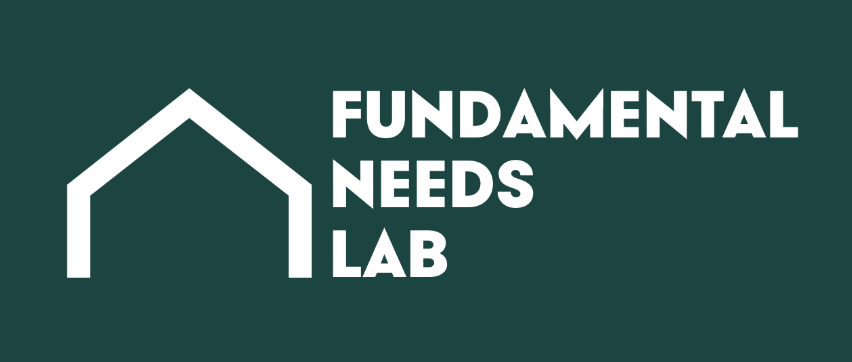

# Students

I like working with dedicated, hard-working undergraduate students and writing papers with them. So far, I have published seven peer-reviewed journal articles with undergrads (and another seven with graduate students).

## Do you need a letter?

I’m happy to support you! [Please fill out this form](https://forms.gle/ygHa866pns5DNj149).

## Do you want to schedule a meeting?

I'm happy to chat! [Please make an appointment with me](https://calendly.com/crabinatree). 👇

[https://calendly.com/crabinatree](https://calendly.com/crabinatree)

## Do you want me to advise a thesis or independent study?

I'm happy to chat about this, too! I’m an active thesis advisor. When I left Dartmouth, I had advised 10 theses in the Department of Government or the Program in Quantitative Social Science over the last five years, the most among faculty across these programs.

I’m interested in working with students on projects dealing with discrimination, particularly class-based discrimination, or focusing on Japan, the Baltics, or Eastern Europe. If you’re interested in the same topics, please read the guidance below and then [contact me](mailto:crabtree@dartmouth.edu). 👇

[Thesis and Independent Study Guidance](Students/Thesis%20and%20Independent%20Study%20Guidance%204241965ee7eb41eeb658be3801bfe137.md)

## Do you want to work with me?

If you’re interested in collaborating with me on research, [I encourage you to contact me](mailto:crabtree@dartmouth.edu). I have had the pleasure of working with 17 different undergrad research assistants at Dartmouth. At this time, I’m primarily working on projects involving understanding the attitudes of individuals facing food and housing needs and what the public thinks of them, ****class-discrimination (i.e., povertyism), or designing interventions to reduce discrimination. Read more about my work on class issues at [needslab.org](http://needslab.org).

If you’re a high school student and interested in being a research assistant for me, please read this guide 👇

[**Opportunities for High School Research Assistants**](Students/Opportunities%20for%20High%20School%20Research%20Assistants%2026779583c8f18016b0b1ea5b3fd622be.md)

---

**Navigation**

[Research](Research%20cca9c791062443e6b6bbb54471e1e133.md)

[Publications](Publications%20cbd8e3fa320a4fa785476f44bf5876c3.md)

[Teaching](Teaching%208479ba326a254914934637f61f245b21.md)

[Collaboration](Collaboration%2081584a40b9c843fea9496935e1aaaba1.md)

[Students](Students%204d95d7928f714665b4d61b4cb23d9789.md)

[Colophon](Colophon%20d579b84903fa49ed9babc699d23a7e20.md)

**Connect & Profiles**

[charles.crabtree@monash.edu](mailto:crabtree@dartmouth.edu)
[monash.zoom.us/my/cdcrabtree](https://monash.zoom.us/j/6125793371?pwd=DQ1orURWUDQmQ7EktnbSt3BThJVllq.1)
[Google Scholar profile](https://scholar.google.com/citations?user=m4hV884AAAAJ&hl=en)
[ORCID profile](https://orcid.org/0000-0001-5144-8671)
[Researchmap.jp profile](https://researchmap.jp/cdcrabtree)
[ResearchGate profile](https://www.researchgate.net/profile/Charles-Crabtree-2?ev=hdr_xprf)
[Web of Science profile](https://www.webofscience.com/wos/author/record/262940)