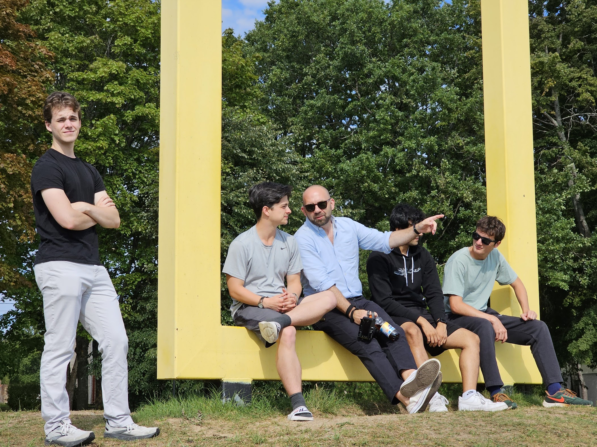
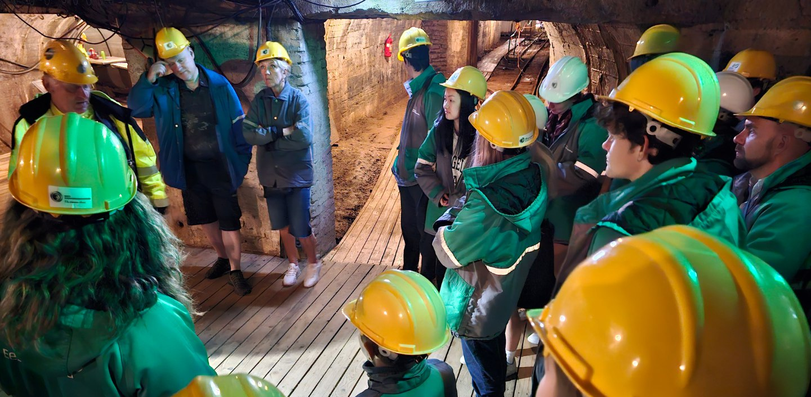
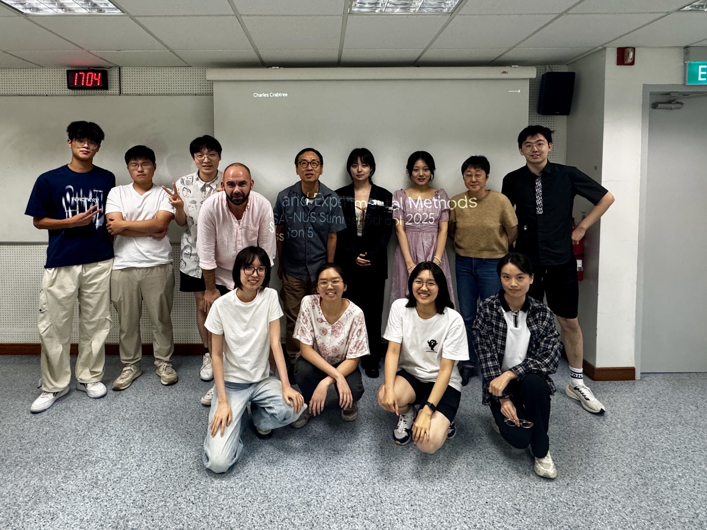

# Teaching

I view teaching and mentoring as ongoing conversations that occur both in and outside the classroom. In class, I teach students about statistical reasoning, research design, democratization, and discrimination, to help them think critically about the many truth claims they’ll encounter in politics and in life. Outside of class, I try to be the kind of mentor I would have wanted to have—approachable, encouraging, and emotionally supportive. I’ve integrated these two aspects into my work as co-director of a Foreign Study Program (FSP) in the Baltics, where students learn through intercultural exchange and by building genuine connections across differences.

## Teaching at Dartmouth

### Statistical reasoning and research design

I taught three classes at Dartmouth that promote statistical reasoning and a better understanding of research design. 

In *Quantitative Political Analysis*, I teach students the basics of computational social science, with their work culminating in a quantitative-focused research paper. In *Experiments in Politics*, I teach students how to design, implement, analyze, and write up the results from an experiment focused on discrimination. I work with students to do this throughout the term, intending to publish the paper after the quarter ends. I’ve published two papers with students using this approach so far.

In addition to these courses, I co-directed the Department of Government’s Honors Program with Professor [Lucas Swaine](https://faculty-directory.dartmouth.edu/lucas-swaine) for a year and a half. In this position, I help students build on their earlier methods classes, such as *Quantitative Political Analysis* and *Experiments in Politics*, and guide them in producing their own independent research. The program requires students to complete the *Honors Research in Government* course in the fall, to spend the winter and spring terms working on their research with their faculty advisers, and to defend their thesis in a public presentation at the end of the year. 

### Democratization and discrimination

In line with my work on discrimination, I believe that intergroup contact can reduce negative biases. I strongly advocate for students pursuing intercultural experiences for this and other reasons. 

I co-founded and have twice co-directed [Dartmouth’s Baltic LEAP (language, energy, and politics) foreign studies program](https://irving.dartmouth.edu/education/experiential-learning-0/baltic-leap-language-energy-and-politics-foreign-study-program) (FSP). This quarter-length program takes students through the three Baltic countries, with students spending about four weeks in Vilnius, two weeks in Riga, and another four weeks in Tartu. In addition to these locations, I and other faculty take the students on day or weekend trips to Jūrmala, Kaunas, Klaipėda, Daugavpils, Narva, Sillamäe, and Tallinn. They complete a full course load while participating in various [excursions](https://t.ly/NSw8V) (e.g., over 20 field trips in the 24-25 academic year; [📷 from our trips](https://photos.app.goo.gl/tPEs1mLENgsWNpyVA)). The [Guarini Institute of International Education](https://guarini.dartmouth.edu/) has lauded this FSP as “innovative” and “cutting edge.”

As part of this program, I teach [*Baltic Politics*](https://t.ly/9nRDv), a course that explores the region through topics related to democracy and discrimination, focusing on the real-world conflicts between representation and inclusion. The course incorporates local voices and features guest lectures from nearby academics, diplomatic staff (including ambassadors), journalists, and policy professionals. It’s one of only two classes on the politics of the Baltics offered by universities in the United States.

With Dartmouth students in Vilnius’ city center.

With Dartmouth students in Estonia.

With Dartmouth students in an oil shale mine.

While Dartmouth does not collect course evaluations for courses offered in FSPs or about FSPs, students have provided extensive positive feedback about the overall program. They have called it “truly life-changing!” “by far the most unique experience you will have,” and “honestly … one of the best experiences of my life.” 

One student’s rumination on my course content.

In a survey conducted three months after the inaugural FSP, students indicated their participation in the program (1) influenced their understanding of their own cultural identity and biases, (2) made them take a more global view of things, and (3) helped them better connect with different types of people.

### Dartmouth evaluations

My top-line evaluations (mean) for these classes are provided below. At Dartmouth, scores *closer to 1* indicate better evaluations; I’ve reverse-coded my scores for interpretability. Click on each course title to see select student evaluations when available. I’ve included some illustrative ones below.

[Dartmouth teaching evaluations](Teaching/Dartmouth%20teaching%20evaluations%20aef4c1ba07f148ef8ec9ddba7d98062a.csv)

### Select Dartmouth evaluation written comments

> I have nothing but the absolute best things to say about Charles Crabtree. One of my favorite professors I have had on this campus and made class so fun while also challenging.
> 

> Professor Crabtree was the best professor I have had at Dartmouth. He was down to earth, helpful, and genuinely cared about his students. He was always willing to meet with us and genuinely wanted to get to know us. He met with my research group multiple times throughout the term (even when he was very busy he always made time for us). Additionally, he responded to emails very quickly which helped answer any questions we had if we were unavailable to meet. Also, his lectures were engaging and he made me want to learn more. He was inspiring and furthered my knowledge in statistics.
> 

> This was a fantastic class! It’s hard to shout out specific things that were most effective, because the entire class was very effective. Professor Crabtree was a great lecturer, and the class was really well structured with group problem sets, individual readings, and our research project, which was a great way to apply our learning to an interesting, real-world topic. Professor Crabtree also wrote really good exams (they made me think so deeply about the course material).
> 

> Prof. Crabtree is one of the most empathetic professors I've ever met, and this makes him a great teacher who prioritizes students' growth.
> 

> Professor Crabtree is very engaging and energetic. He is very supportive and makes himself frequently accessible to students. He is a kind person and wants to make a positive impact.
> 

> prof crabtree is one of the best professors i have had in my time at dartmouth. he is incredibly supportive, explains statistical concepts very well, and is also excellent at demonstrating why statistical analysis matters to a group of people who was mostly only in the class to fulfill a prereq or distributive. i never expected to have a good time in this class, but it ended up being actually pretty enjoyable and i learned a lot.
> 

> The professor is one of the kindest most understanding people, and as such engagement in the class was incredibly high. We were able to think of great ideas and felt supported in the environment.
> 

> Amazing teaching and good class structure.
> 

> Professor Crabtree is by far the best professor I have had at Dartmouth.
> 

## Teaching at other universities

### Research design and experiments

I've been fortunate to teach various methods courses around the world. In general, these methods courses reflect my core research and teaching concerns about measurement and inference. I’ve taught classes on AI, experiments, measurement, and geospatial analysis across various summer methods programs, including the [Institute for Qualitative and Multi-Method Research (IQMR)](https://www.maxwell.syr.edu/research/center-for-qualitative-and-multi-method-inquiry/institute-for-qualitative-multi-method-research) at Syracuse University, the [Essex Summer School in Social Science Data Analysis](https://essexsummerschool.com/), and the [IPSA-NUS Summer School for Social Science Research Methods](Teaching%208479ba326a254914934637f61f245b21.md).  

I’ve also taught multiple workshops on experiments and text analysis for graduate students at Waseda University and co-taught two classes on *Computational Text Analysis for Legal Practice* at the University of Virginia School of Law with [Kevin Cope](https://www.law.virginia.edu/faculty/profile/kc9fz/2381999).

With my AI and Experimental Methods students at IPSA-NUS 2025.

In addition, I've taught numerous short, informal methods workshops at universities in the United States, Europe, and Asia. According to the surveys I’ve administered at the end of these workshops, [attendees have found them very helpful](Teaching/Workshop%20evaluations%2092b9c22bbe7b497f80c544a5f5326a49.md), with 80% rating them more helpful than similar workshops.👇

[Workshop evaluations](Teaching/Workshop%20evaluations%2092b9c22bbe7b497f80c544a5f5326a49.md)

## Teaching outside the university

### Experiments

While universities will always be at the center of my teaching, and I have a deep affection for institutions of higher learning, I also enjoy working with private organizations that provide methodological training to researchers. In that vein, I’ve taught a course on *AI-Enhanced Experiments* for [Instats](Teaching%208479ba326a254914934637f61f245b21.md) and will soon teach *Using AI to Build Better Experiments* for [Statistical Horizons](https://statisticalhorizons.com/).

## Student song recommendations

In every Dartmouth syllabus, I ask students to show that they’ve read it by sharing their favorite song. Here are their picks.

[https://open.spotify.com/playlist/4ZpxxoVmqSrN9lvgtjKpxi?si=kuGkcQWsRaOThqKVqriW-A&pt=932d427c8bbd50739fb04a596e49e570](https://open.spotify.com/playlist/4ZpxxoVmqSrN9lvgtjKpxi?si=kuGkcQWsRaOThqKVqriW-A&pt=932d427c8bbd50739fb04a596e49e570)

---

**Navigation**

[Research](Research%20cca9c791062443e6b6bbb54471e1e133.md)

[Publications](Publications%20cbd8e3fa320a4fa785476f44bf5876c3.md)

[Teaching](Teaching%208479ba326a254914934637f61f245b21.md)

[Collaboration](Collaboration%2081584a40b9c843fea9496935e1aaaba1.md)

[Students](Students%204d95d7928f714665b4d61b4cb23d9789.md)

[Colophon](Colophon%20d579b84903fa49ed9babc699d23a7e20.md)

**Connect & Profiles**

[charles.crabtree@monash.edu](mailto:crabtree@dartmouth.edu)
[monash.zoom.us/my/cdcrabtree](https://monash.zoom.us/j/6125793371?pwd=DQ1orURWUDQmQ7EktnbSt3BThJVllq.1)
[Google Scholar profile](https://scholar.google.com/citations?user=m4hV884AAAAJ&hl=en)
[ORCID profile](https://orcid.org/0000-0001-5144-8671)
[Researchmap.jp profile](https://researchmap.jp/cdcrabtree)
[ResearchGate profile](https://www.researchgate.net/profile/Charles-Crabtree-2?ev=hdr_xprf)
[Web of Science profile](https://www.webofscience.com/wos/author/record/262940)