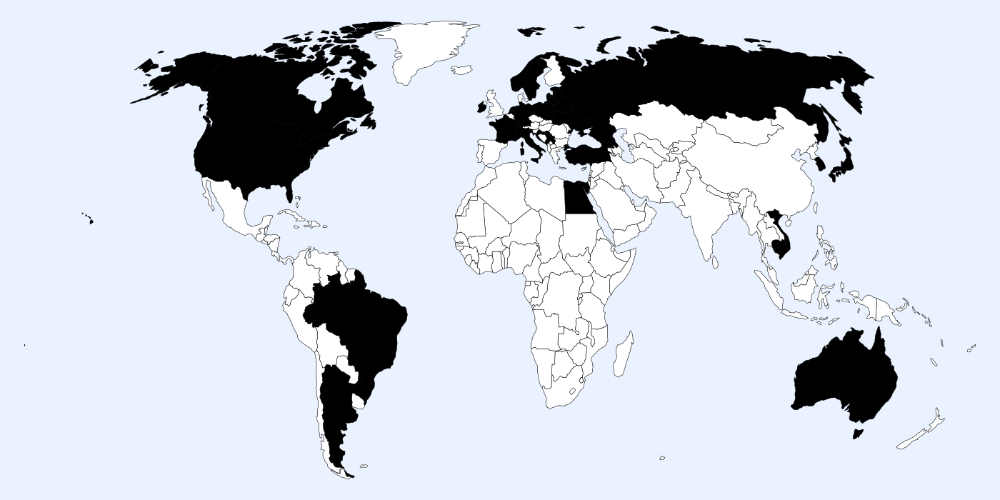
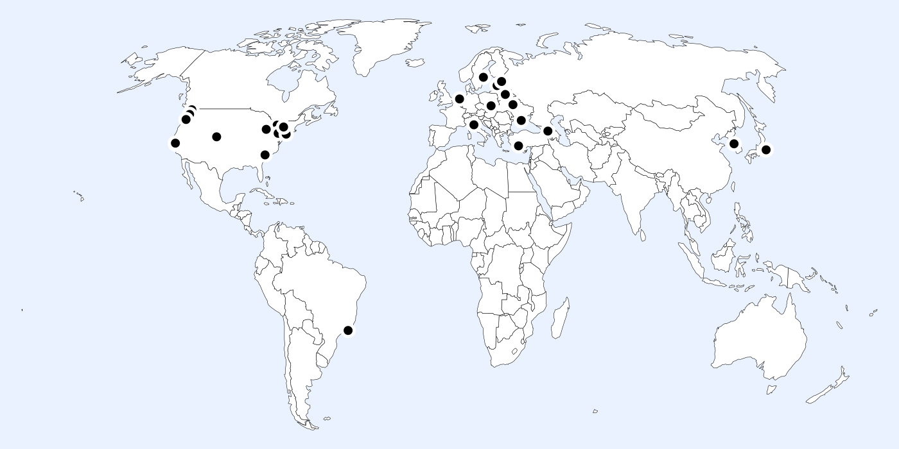

# Travel

Like nearly every academic I know, I love to travel. I’ve been to over 30 countries now. As Susan Sontag said, “I haven't been everywhere, but it's on my list.” 👇

Countries visited.

Thanks to an itinerant youth, and an even more itinerant adulthood, I’ve also lived in more than 30 cities for over a month. 👇

Places once called home.